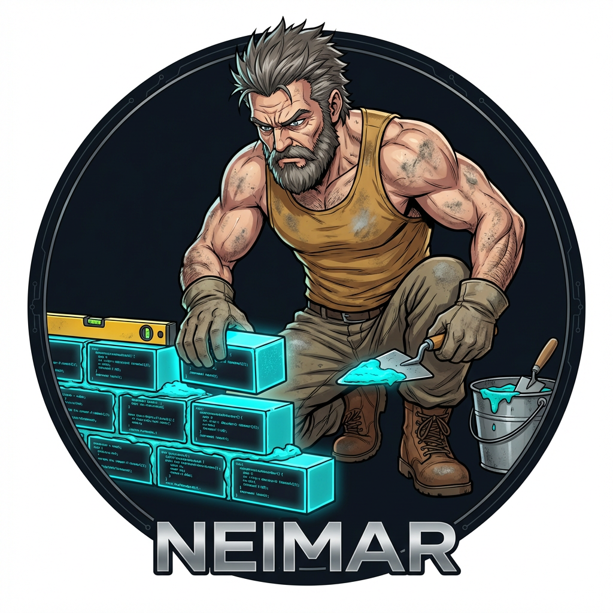
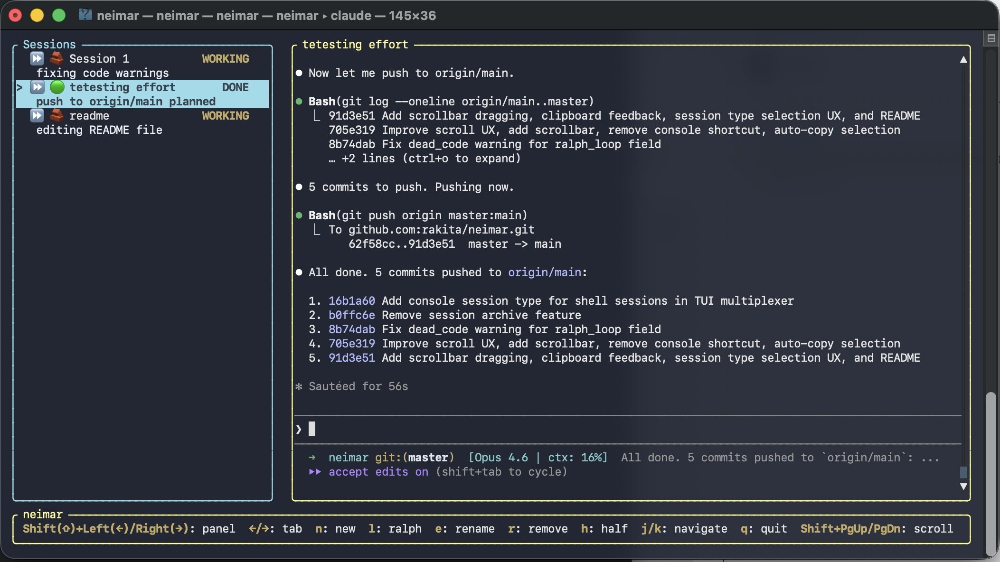

<p align="center">
  
</p>

# Neimar

TUI multiplexer for managing multiple AI CLI sessions in a terminal. Run several Claude, Amp, or shell sessions side-by-side with full terminal fidelity.

The name *neimar* is a Serbian word meaning "builder" or "master builder" — fitting for a tool that helps you build things with AI.



## Features

- **Multi-session** — Run multiple AI sessions simultaneously, switch between them instantly
- **Full PTY fidelity** — Each session runs in a real pseudo-terminal; colors, cursor movement, and line wrapping all work correctly
- **Live status monitoring** — Tracks model name, cost, context window usage, turn count, and permission mode per session
- **AI state classification** — Automatically detects whether each session is working, waiting for input, or done
- **Mouse support** — Click to select sessions, drag to resize panels, scroll output, drag-select text
- **Clipboard integration** — Auto-copy text selections, Cmd+C to copy
- **Scrollback** — Scroll through session output history with keyboard or mouse
- **Multiple CLI types** — Claude, Amp, or plain shell sessions
- **Agents directory** — Browse and view agent definition files from a dedicated tab
- **Ralph loop** — Automated prompt injection for iterative Claude workflows

## Build & Run

```bash
cargo build          # compile
cargo run            # run the app
```

## Status Indicators

### Session State

| Emoji | State | Meaning |
|-------|-------|---------|
| 🧱 | Working | Session is actively producing output |
| 💬 | Input | Waiting for user input |
| 📋 | Planned | Plan prompt shown, awaiting approval |
| 🟢 | Done | Session is idle |
| ⏳ | Starting | Session just started |
| 🔒 | Closed | Session exited normally |
| 🔴 | Failed | Session failed to start |

### Permission Mode (Claude sessions)

| Emoji | Mode | Meaning |
|-------|------|---------|
| ⏸ | Plan | Claude is in plan mode |
| ⏩ | Edit | Claude is auto-accepting edits |

## Session Types

When creating a new session (`n`), choose a type:

| # | Type | Icon | Description |
|---|------|------|-------------|
| 1 | Claude | 🤖 | Claude CLI session |
| 2 | Amp | ⚡ | Amp CLI session |
| 3 | Console | >_ | Plain shell session |

## License

Licensed under either of [Apache License, Version 2.0](LICENSE-APACHE) or [MIT License](LICENSE-MIT) at your option.

Unless you explicitly state otherwise, any contribution intentionally submitted for inclusion in this crate by you, as defined in the Apache-2.0 license, shall be dual licensed as above, without any additional terms or conditions.
